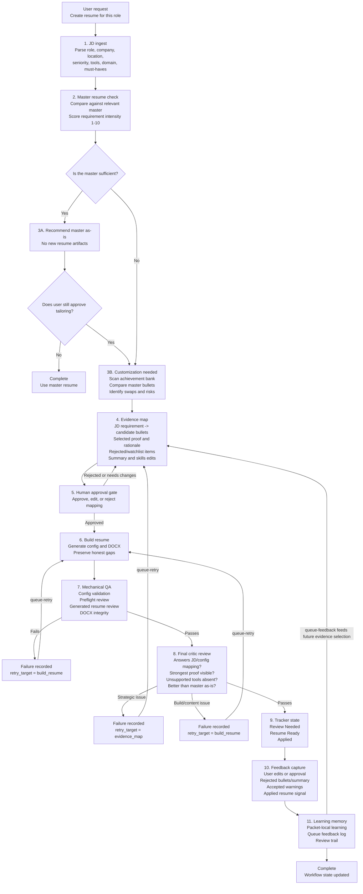

# Career Ops Copilot

An AI-assisted career workflow control layer for managing job-search state, resume review gates, and application follow-ups with auditable CSV files.

This project started as a real personal operating system for evaluating roles, generating tailored resumes, tracking review quality, and managing application follow-ups. I converted it into a public-safe sample project by removing private application history and replacing it with anonymized example data.

## What This Demonstrates

- AI workflow design with human review gates instead of blind generation.
- Product analytics judgment around lifecycle states, source-of-truth rules, and exception handling.
- Lightweight automation over transparent data rather than unnecessary platform complexity.
- Practical operating discipline: schema validation, status transitions, duplicate checks, and follow-up tracking.

## Why I Built This

Modern job search creates a messy workflow: job descriptions, fit scoring, resume versions, review status, application dates, follow-ups, and notes all live in different places. I wanted a small system that could keep a simple CSV workflow but add enough structure to make it reliable.

The goal was not to build a heavy SaaS app. The goal was to build a high-agency operating layer around AI-assisted career work: use AI to research and draft faster, but keep the final workflow grounded in schema validation, status transitions, review notes, and source-of-truth discipline.

## What It Does

- Validates job-search and application-tracker CSV schemas.
- Enforces clean lifecycle states such as `Pursued`, `Draft Built`, `Review Needed`, `Resume Ready`, and `Applied`.
- Orchestrates resume workflow packets through master-check, evidence-map, approval, build, QA, critic, and feedback states.
- Allows multiple roles to be analyzed/proposed in parallel while enforcing a single serialized build slot.
- Promotes a pursued role from the job log into the application tracker.
- Tracks resume coverage scores, review status, accepted warnings, application dates, and follow-up dates.
- Sorts state files into a consistent order.
- Keeps the workflow transparent by using plain CSV files instead of a hidden database.

For the full lifecycle, see [docs/workflow.md](docs/workflow.md).

## Workflow Model

```text
Researched -> Pursued -> Draft Built -> Review Needed -> Resume Ready -> Applied
```

The key design choice is that generated work cannot jump straight to completion. For example, a resume cannot be marked `Resume Ready` unless the review status is `Passed` or `Warning Accepted`. That forces the workflow to record quality judgment before an application is treated as ready.

## Resume Workflow Architecture

The resume workflow is designed as a gated system, not a one-shot generation task. The agent first decides whether customization is even justified, then maps the job description to source-backed achievements, asks for approval, builds the resume, and runs a final critic pass before the artifact is treated as ready.



The key product decision is the separation between **generation** and **approval**. AI can draft and compare quickly, but the workflow forces evidence mapping, explicit approval, mechanical validation, and a final critic review before a resume moves forward.

Failures are expected to loop backward, not move forward with caveats. Mechanical QA failures are recorded with `queue-fail --retry-target build_resume`, then reopened with `queue-retry` before another build can start. Final critic failures use either `--retry-target evidence_map` for strategy issues or `--retry-target build_resume` for content/build issues. A failed packet cannot jump straight back into `building`; the retry target must be opened and repaired first.

The feedback loop is different from the QA loop. QA and critic loops fix the current resume; feedback capture improves future resumes. It is triggered after review, approval, rejection, accepted warnings, manual edits, or application. Those signals are captured with `queue-feedback`, updating packet-local learning memory, a queue-level feedback log, and the packet review trail so the next evidence map starts with stronger preferences.

In the private version of this system, future tailored resume configs are blocked unless they record the master-resume gate, the achievement-bank scan, the master-vs-tailored comparison, and confirmation that user approval happened after the evidence map was presented. That makes the review process auditable instead of relying on the agent to remember the right sequence.

The private workflow also has a small pre-build command that prints the gate decision before any files are written. That keeps the first decision separate from generation:

```bash
python3 -B scripts/resume_gate_check.py \
  --company "ExampleCo" \
  --role "Analytics Manager" \
  --track A \
  --requirement-intensity 8 \
  --gate-decision customization_needed \
  --reason "The JD has specialized BI, data-quality, and stakeholder-mapping requirements beyond the master resume." \
  --next-action "Run achievement-bank evidence mapping and ask Ashish to approve the proposed swaps."
```

## Evidence-Mapping Pattern

The customization step uses a simple evidence matrix rather than keyword stuffing:

```text
JD requirement:
  "Develop datasets, data systems, and simple pipelines"

Achievement-bank candidates:
  HR_24 -> reporting modernization with validated staging layers
  HR_18 -> analytics migration QA across production queries
  BW_14 -> SQL dimensional model / source of truth
  RZ_02 -> checkout data normalization

Decision:
  Use HR_24 and BW_14 as primary evidence.
  Use HR_18 only if migration or pipeline support is central to the JD.
```

This keeps the workflow grounded in verified achievements. It also creates a visible audit trail for why a bullet was selected, why another was rejected, and which claims should not appear in the resume.

## Why This Shows AI Fluency

This project reflects how I use AI in practical work: not as a replacement for judgment, but as a speed layer inside a controlled system.

The AI-assisted parts of the workflow help with job description analysis, resume tailoring, coverage review, and next-step reasoning. The CLI then acts as the control layer that keeps the system honest: it validates schemas, forces review gates, records accepted warnings, and prevents applications from being marked complete before the resume is ready.

That combination is important for new-age analytics work too. AI can accelerate analysis and reporting, but the durable value comes from trusted foundations, clear definitions, reproducible workflows, and human judgment.

## Project Structure

```text
career-ops-copilot/
  career_ops/
    cli.py
  data/
    sample_job_search_log.csv
    sample_application_tracker.csv
    sample_resume_queue/
  docs/
    workflow.md
  README.md
  pyproject.toml
```

## Quick Start

Run directly with Python:

```bash
python3 -B career_ops/cli.py validate-state
```

Or install locally in editable mode:

```bash
python3 -m pip install -e .
career-ops validate-state
```

By default, commands run against the bundled anonymized sample files:

```text
data/sample_job_search_log.csv
data/sample_application_tracker.csv
data/sample_resume_queue/
```

To use your own CSV files, pass the file paths before the command:

```bash
career-ops \
  --job-log path/to/job_search_log.csv \
  --tracker path/to/application_tracker.csv \
  validate-state
```

## Example Commands

Validate the current state:

```bash
career-ops validate-state
```

Example output:

```text
[PASS] career ops state is valid
Job log rows: 3
Tracker rows: 1
Summary: 0 error(s), 0 warning(s)
```

Sort the CSV files into canonical order:

```bash
career-ops sort
```

Promote a role from the job log into the application tracker:

```bash
career-ops promote-role \
  --company "Northstar CRM" \
  --role "Product Analytics Lead" \
  --output-file "Ashish_Product_Analytics_Northstar.docx" \
  --tier1 88 \
  --tier2 81 \
  --legacy-no-queue
```

Mark a resume as needing review:

```bash
career-ops mark-review-needed \
  --output-file "Ashish_Product_Analytics_Northstar.docx"
```

Mark a resume as ready after review:

```bash
career-ops mark-ready \
  --output-file "Ashish_Product_Analytics_Northstar.docx" \
  --review-status "Passed" \
  --legacy-no-queue
```

Mark an application as submitted and create a follow-up date:

```bash
career-ops mark-applied \
  --output-file "Ashish_Product_Analytics_Northstar.docx" \
  --applied-date 2026-04-30
```

Together, these commands show the legacy/sample operating loop: validate state, promote a role, move the resume into review, mark it ready only after review, then mark the application submitted. New resume builds should normally come from a `ready` queue packet; `--legacy-no-queue` is only for older/manual artifacts or the bundled sample flow.

## Resume Queue Commands

The queue commands make the architecture live. They create one JSON packet per role and move it through the master gate, evidence map, approval, serialized build slot, and ready/failed states.

Add two roles to the queue:

```bash
career-ops queue-add \
  --company "Northstar CRM" \
  --role "Product Analytics Lead" \
  --track A \
  --jd-url "https://example.com/jobs/northstar"

career-ops queue-add \
  --company "LedgerWorks" \
  --role "BI Manager" \
  --track A \
  --jd-url "https://example.com/jobs/ledgerworks"
```

Record the master-resume gate and proposed evidence map:

```bash
career-ops queue-gate \
  --role-id "northstar-crm__product-analytics-lead" \
  --requirement-intensity 8 \
  --gate-decision customization_needed \
  --reason "The JD emphasizes specialized product analytics, governance, and stakeholder mapping beyond the master resume." \
  --next-action "Scan the achievement bank and ask for approval on proposed bullet swaps."

career-ops queue-propose \
  --role-id "northstar-crm__product-analytics-lead" \
  --evidence-map "Map JD analytics governance to source-backed dashboard, instrumentation, and data-quality bullets." \
  --proposed-changes "Move data-quality proof higher, tune summary toward product analytics leadership, and avoid unsupported tools."
```

Approve and enter the serialized build slot:

```bash
career-ops queue-approve \
  --role-id "northstar-crm__product-analytics-lead" \
  --approval-note "Approved after reviewing the evidence map and proposed bullet swaps."

career-ops queue-start-build \
  --role-id "northstar-crm__product-analytics-lead" \
  --output-file "Ashish_Product_Analytics_Northstar.docx"
```

Only one packet can be in `building` at a time. Other roles can still sit in `proposed` or `approved`, but they cannot enter the build slot until the active build is completed or failed.

Complete or fail the build:

```bash
career-ops queue-complete-build \
  --role-id "northstar-crm__product-analytics-lead" \
  --output-file "Ashish_Product_Analytics_Northstar.docx" \
  --mechanical-qa "Passed" \
  --final-critic "Passed"

career-ops queue-fail \
  --role-id "northstar-crm__product-analytics-lead" \
  --stage final_critic \
  --reason "Final critic found the strongest evidence was not above the fold." \
  --retry-target evidence_map

career-ops queue-retry \
  --role-id "northstar-crm__product-analytics-lead" \
  --retry-target evidence_map \
  --note "Reopening the evidence map before another approval/build cycle."

career-ops queue-feedback \
  --role-id "northstar-crm__product-analytics-lead" \
  --signal-type accepted_warning \
  --note "Accepted a minor summary tradeoff because the role-specific evidence stayed stronger."

career-ops queue-archive \
  --role-id "northstar-crm__product-analytics-lead" \
  --reason "Master resume was recommended and no tailored artifact was needed."
```

View queue state:

```bash
career-ops queue-status
career-ops validate-queue
```

Queue writes are lock-protected and packet files are written atomically. Tracker/log CSV writes are also protected with a state lock and atomic replacement. The sample queue ignores generated JSON files and queue feedback logs in Git so private JD mappings, approval notes, and feedback signals are not accidentally committed. For real usage, keep queue packets outside this public repo and pass `--resume-queue`.

## Design Choices

I kept the storage layer as CSV because it is easy to audit, easy to edit manually, and works well with AI-assisted workflows. The CLI provides the guardrails that spreadsheets usually lack: required headers, controlled status values, date validation, duplicate detection, and lifecycle rules.

I also separated `sample_job_search_log.csv` from `sample_application_tracker.csv` because the job-search funnel has two different modes: many roles are researched and rejected, while only a smaller set become active resume/application work.

Resume orchestration uses JSON packets instead of CSV rows because each role needs nested state: master-gate details, evidence-map notes, approval metadata, build status, failure reasons, and feedback memory. The queue stays file-based and auditable, but it avoids forcing nested workflow state into wide CSV columns.

## Sample Data

The repository includes anonymized sample rows only. The original private job-search data, personal resume files, application history, and company-specific notes are intentionally excluded.

The sample files are intentionally named with the `sample_` prefix so they are clearly public demo data, not production state.

`data/sample_resume_queue/` is intentionally empty except for a placeholder file. It demonstrates where public-safe queue packets live without exposing private job descriptions, resume mappings, or approval notes.

## Inspiration and Attribution

This project was inspired in part by the publicly available [santifer/career-ops](https://github.com/santifer/career-ops) project, an open-source AI-powered job search system that shows how agentic tools can support job evaluation, CV generation, batch processing, and pipeline tracking.

Career Ops Copilot is an independent, smaller implementation focused on the control layer I wanted to demonstrate publicly: CSV-backed state, lifecycle validation, review gates, and auditable status transitions. The inspiration was the broader idea of treating career operations as a structured workflow; the implementation here is intentionally simplified, anonymized, and public-safe.

## Repository Description

Suggested GitHub description:

> AI-assisted career operations copilot for job tracking, resume workflow management, review gates, and application follow-ups.

## Topics

Suggested GitHub topics:

`python`, `cli`, `csv`, `workflow-automation`, `job-search`, `ai-workflows`, `product-analytics`, `career-ops`

## Change Log and Design Learnings

### 2026-05-13: Strengthened AI workflow guardrails

I refined the project framing to make the central design principle clearer: AI can accelerate drafting, comparison, and reasoning, but final decisions still need explicit review gates. In this workflow, a resume or application cannot move forward just because it was generated. It needs a visible lifecycle state, accepted review status, and traceable notes.

This is the same discipline I apply in analytics and product work. A dashboard, experiment readout, or AI-generated recommendation is only useful when definitions are clear, ownership is explicit, and the system prevents low-quality outputs from being treated as final.

### 2026-05-13: Kept the source of truth deliberately simple

I kept the storage layer as plain CSV instead of moving immediately to a database because the goal is auditability and control, not technical complexity. CSVs make every state change visible, easy to inspect, and easy to reconcile. The CLI adds the missing guardrails: schema validation, lifecycle checks, controlled statuses, duplicate detection, and review requirements.

The product lesson is that good automation does not always require a heavier stack. For small operational systems, the right design is often a thin control layer over a simple, transparent source of truth.

### 2026-05-13: Separated reusable workflow logic from private data

The original workflow came from a real job-search operating system with private resumes, application history, and company-specific notes. I intentionally converted this repository into a public-safe version with anonymized sample files. That separation matters because the reusable value is the workflow pattern, not the private data.

This reflects a broader analytics design habit: separate the reusable framework from sensitive records. The same validation, state management, and review-gate pattern can be reused without exposing confidential inputs.
